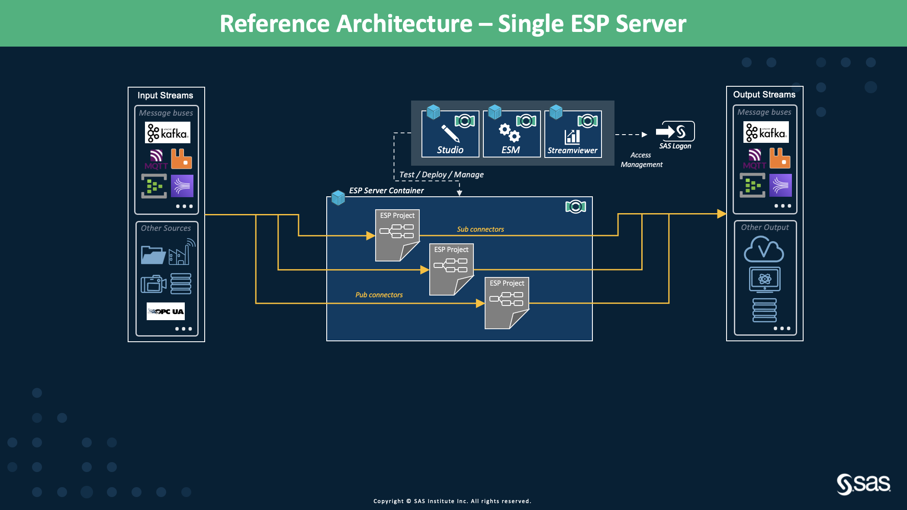
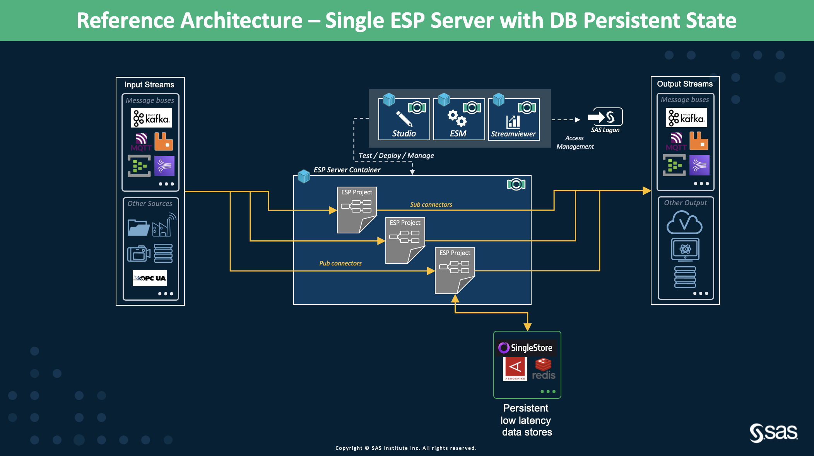
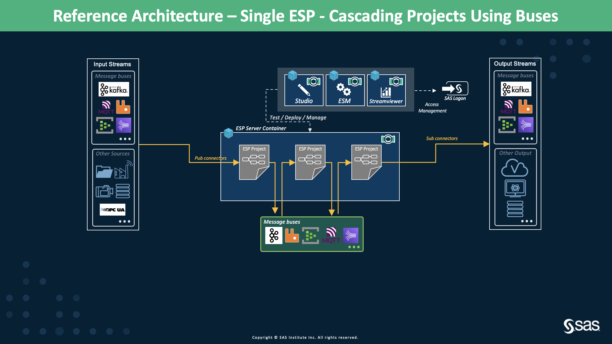
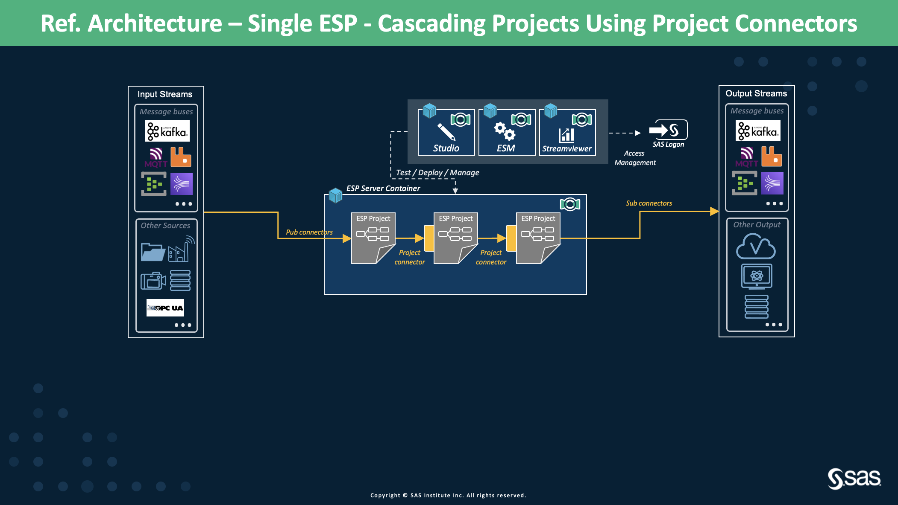

# Single ESP Server Deployment

* [Overview](Single_ESP_Server.md#overview)
* [Deployment Flavors](Single_ESP_Server.md#deployment-flavors)
  * [Standard Deployment](Single_ESP_Server.md#standard-deployment)
  * [Stateless Models with DB for Persistent State](Single_ESP_Server.md#stateless-models-with-db-for-persistent-state)
  * [Multiple Cascading Projects](Single_ESP_Server.md#multiple-cascading-projects)
    * [Multiple Cascading Projects Using Message Bus](Single_ESP_Server.md#multiple-cascading-projects-using-message-buses)
    * [Multiple Cascading Projects Using ESP Router](Single_ESP_Server.md#multiple-cascading-projects-using-esp-router)
    * [Multiple Cascading Projects Using ESP Project Publish Connectors](Single_ESP_Server.md#multiple-cascading-projects-using-esp-project-publish-connectors)

## Overview
In this section, we will present several architectures where the ESP server runs inside a docker container. If required we can start multiple ESP servers from inside the container running on different ports just like a bare-metal deployment. However, we have to take care that required ports are mapped. In this deployment, we can also run individual dockers for the ESP web-clients, i.e., ESP Studio, ESP Streamviewer, and Event Stream Manager (ESM). All the ESP docker images can be deployed on-premises or in a cloud virtual machine. Multiple ESP projects can run on the same ESP server from ESP Studio or ESM as done traditionally. 

ESP docker images are packaged with connectors and adapters to publish and subscribe to the events. ESP adapters and ESP connectors are quite similar except ESP adapters must be started as a separate process from the ESP server while ESP connectors start when the ESP project starts (also managed by connector orchestration to some extent). ESP adapters must be used instead of ESP connectors when the administrator needs to control the start and stop of sending data to the ESP project.

This architecture is ideal for quick model development and testing with full control on the setup without going into the intricacies of deploying the K8s cluster.

**NOTE:** *During events of failure or crash, ESP server, ESP projects, connectors, adapters, etc. must be manually restarted. There are no automatic restart mechanisms for these architectures. Custom scripts can be written to achieve some automation.*

### ESP deliverables
- Linux Docker images of ESP server, ESP Studio, ESP Streamviewer and ESM. Available from version 6.2 onwards.

## Deployment Flavors

### Standard Deployment
<figure align="center">
  
  <figcaption><i>Figure 1: Single ESP Server Standard Deployment</i></figcaption>
</figure>

Figure 1 presents the single ESP server deployment on a single virtual machine (VM) in a cloud or on-premises. This is the simplest deployment strategy with one ESP server and the ESP web clients, all running in their containers. The only requirement is to have docker running in the VM.

#### Characteristics
- This architecture is closest to the traditional way we have been working with ESP. There will a single ESP server with its hostname and port. The web clients (ESP Studio, ESP Streamviewer, and ESM) settings will point to that ESP server.
- To handle the required rate of incoming data and to achieve the desired throughput, VM must be vertically scaled for more resources (CPU and memory).
- This architecture is suitable if high availability and state persistence are not an issue in case of failovers. Again, the architecture is on the same lines as the traditional ESP server where we can live with ESP server or VM failures.
- The deployment is more deterministic as we know exactly where the projects are running. Additionally, we can interact directly with the running ESP projects using the REST calls. This is helpful to find issues like memory leaks in the model due to the wrong state management. Therefore, recommended architecture for ESP project development and basic testing.
- Any extra libraries or plugins are installed on the VM. They are shared by the ESP servers through shared volumes. This does not require any changes in the ESP docker image. This is helpful in the case of some ESP connectors, for example, the MQTT connector which has dependencies on the 3rd party libraries.
- The ESP web-clients dockers can run in the same VM as that of the ESP server or on a different VM(/s).
- ESP server docker deployment can use other services such as CAS data storage and 3rd party.

#### Limitations
- Performance of the server is limited by the configuration of the machine where the docker is running. ESP uses thread pools for increasing the performance which in turn depends on the number of CPU cores on the machine. All the projects running on the ESP server share the same set of resources (CPU and memory). The only way to increase the performance is through vertical scaling of the machine (i.e., increasing the CPU cores and RAM of the machine). Therefore, the sizing effort must be considered.
- The amount of state retained in the ESP model depends on the size of available RAM. ESP server stores data in-memory for better performance, so if the RAM is full, the ESP server will stop. Multiple projects running in the same ESP server share the resources, therefore, the RAM availability depends on the state retained by all the ESP projects.
- If the ESP server stops, then all the projects running on the server will also stop. The ESP server and projects must be started manually. Custom scripts can be used to monitor the state of projects and the ESP server.
- If an ESP project crashes/fails to lead to shut down of the ESP server, all the other projects will stop too.
- No multi-tenancy and multi-users support is present. 
- No ESP server scalability.

#### Discussion
This setup is very similar to ESP on edge.

### Stateless Models with DB for Persistent State

<figure align="center">
  
  <figcaption><i>Figure 2: Single ESP server with DB for persistent state</i></figcaption>
</figure>

#### Description
Figure 2 illustrates the architecture of a single ESP server with an in-memory database for state persistence. SAS provides a plugin to connect to low latency and high throughput Aerospike, SingleStore, and Redis in-memory databases to persist state and data for join and aggregation operations. 

#### Characteristics
- This architecture provides recovery of ESP server without losing any state in case of server crash or machine failure. Persisted state and data in the in-memory databases are used for recovery from failure.
- The ESP projects can now be designed stateless for aggregation and join operations as the states are stored in the in-memory database.
- The in-memory DB can run on a separate VM or a cluster with higher RAM and storage while the ESP server can run on a separate VM with lesser RAM. This is because ESP doesn't need to store events RAM anymore.

#### Limitations
- Throughput and latency must be tested thoroughly in this setup. Due to the network-level communication with the 3rd party in-memory databases, we are bound to see some performance degradation (it might not be an issue for some of the use cases).
- It is a single ESP server deployment, therefore, the model cannot scale up horizontally to achieve higher performance.
- Customers/Partners would need extra hardware/resources to set up the in-memory database cluster which implies an added cost. 
- State information related to open patterns, geofences, and streaming analytics are not stored in the in-memory database.

#### Discussion
The performance of this architecture must be thoroughly tested to ensure it matches the required SLOs. With the increase in the streaming data, the performance may degrade drastically.

### Multiple Cascading Projects
It is a good practice and strategy to break a huge project into sub-projects based on the use case modeling requirements. To understand it better, let's consider an example. If the use case demands finding a pattern in the streaming events followed by some calculations/transformations based on the pattern then we can have two ESP projects instead of one. The first project will find the pattern and the second project will perform the calculations. The output from the first project is fed as input to the second project. 

Having multiple cascading projects allows easy maintenance of the whole project flow. Projects are independent of each other which allows debugging the specific sub-project without touching the other sub-projects. Sub-projects can be reused across multiple projects if two separate projects require similar data processing.

The major drawback of having cascading projects is that if one sub-project stops then the whole project cascade stops. There might be some performance degradation due to the communication between sub-projects. Breaking a project into sub-projects needs to be handled carefully to avoid duplication of scenarios. Having extra Source windows is inevitable.

There can be various ways by which sub-projects can communicate with each other. We discuss them next.

#### Multiple Cascading Projects Using Message Buses
<figure align="center">
  
  <figcaption><i>Figure 3: Single ESP server with cascading projects using message buses</i></figcaption>
</figure>

##### Characteristics
- This can be the same message bus bringing in the data to the first sub-project or a different one. 
- The message bus can run anywhere, in the VM or outside as long as ESP has access to it. However, one must consider the network latency induced because of the communication.
- Having message buses for communication allows loosing coupled sub-projects. 
- If the message bus has a configurable retention policy, for example, Kafka, then the streaming events can be stored in the configured Kafka topics. This allows sub-projects to start independently of each other without any data loss.

##### Limitations
- 3rd party message buses are required to be configured and managed (either in the same machine as of the ESP server or different). This can be an open-source or licensed version of the message bus. 
- There is a chance of reduced overall performance because of induced network latency for the communication between ESP and message buses. Performance must be thoroughly tested to ensure it complies with the desired SLOs.
- Availability of the message bus becomes critical for the projects to run. Customers/Partners must consider the high availability and resiliency configurations for the message bus. This would have added cost for additional resources.

#### Multiple Cascading Projects Using ESP Router
<figure align="center">
  
  <figcaption><i>Figure 4: Single ESP server with cascading projects using ESP router</i></figcaption>
</figure>

##### Description 
In Figure 4, we present the high-level architecture of multiple cascading projects connected via the [ESP router](https://go.documentation.sas.com/doc/en/espcdc/v_013/espxmllayer/n0hygnviv2kt6mn1vhnkgtsolxt7.htm). In the diagram, we have all the ESP projects and ESP router running in the same ESP server. ESP router enables disintegrating larger ESP projects into multiple and connects them seamlessly to perform the end-to-end stream processing.

##### Characteristics
- The ESP router can run on the same ESP server or a different ESP server.
- The ESP Router is capable of distributing events from the upstream project to downstream project(/s) where these downstream project/(s) could be running in the same ESP server or different ESP servers.
- ESP router allows user-defined condition/(s) based routing. 
- We have better performance when the ESP router and downstream project/(s) co-habits in the same ESP server because now the events will be injected directly to the downstream ESP project/(s) without going through Pub/Sub APIs.

##### Limitations
- ESP Studio does not support creating/designing the ESP Router. XML router definition must be created manually.
- All the ESP projects and ESP router must be started manually and in the right sequence. For example, starting downstream projects first, followed by starting ESP router and then starting the upstream project.
- If one of the projects stops/fails/crashes, then the restart procedure must be followed due to the dependencies. 

#### Multiple Cascading Projects Using ESP Project Publish Connectors
<figure align="center">
  
  <figcaption><i>Figure 5: Single ESP server with cascading projects using ESP project publish connectors</i></figcaption>
</figure>

##### Description
Another solution to stream events from one project to another is via [ESP Project Publish Connector](https://go.documentation.sas.com/doc/en/espcdc/v_013/espca/p0nd0g1i4np1h1n15zmar9fhln8u.htm) as shown in Figure 5. ESP project connector can connect to the project running on the same ESP server or a different ESP server. 

##### Characteristics
- The ESP project connector is configured in the sub-project which gets the events from a different window of a different project. Connector starts automatically when the sub-project starts.
- The ESP project publish connector properties can be modified from ESP Studio just like we do for other ESP connectors.
- If all the projects are running in the same ESP server, then only a single copy of the event is stored in the memory as the ESP project publish connector uses a reference-counted copy of the events. Therefore, memory-optimized.  

##### Limitations
- ESP project connector causes tight coupling between the projects. If the source project crashes/stops, then the flow of events to the downstream projects stops as well. They must then be restarted manually.
- Sequence of starting the projects matters as the connectors need to have the source project running. There is a chance of data loss by the time all the sub-projects start because the source project needs to be running for the destination project connector to connect to.

