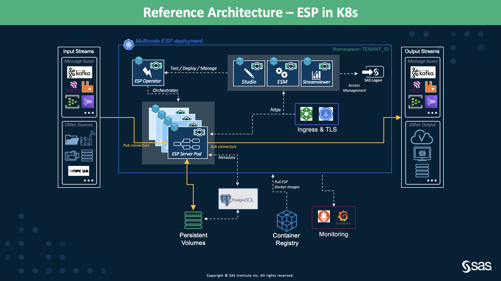
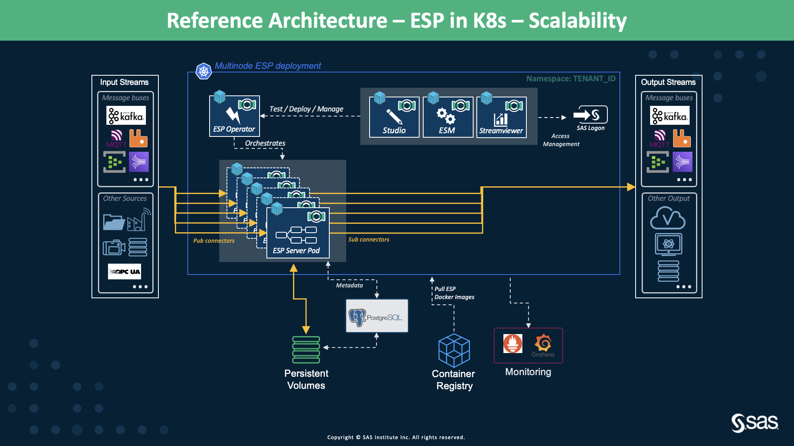
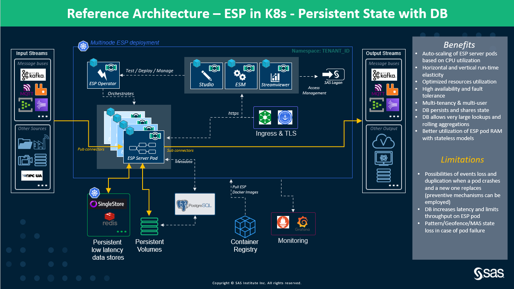
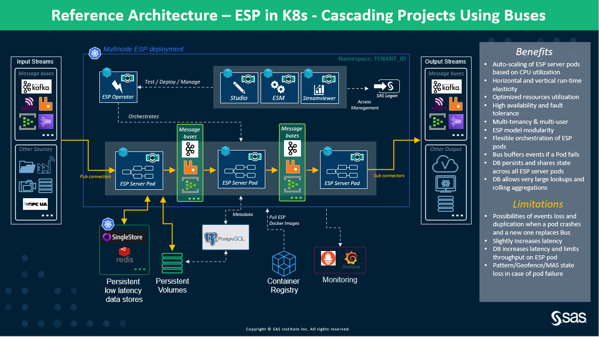

# High-Level Architecture of Multi-Node ESP Kubernetes Deployment In K8s

* [Overview](multi_node_esp_kubernetes_operator_framework.md#overview) 
* [Deployment Flavors](multi_node_esp_kubernetes_operator_framework.md#deployment-flavors) 
  * [ESP projects Using ESP Server Pod Memory](multi_node_esp_kubernetes_operator_framework.md#esp-projects-using-esp-server-pod-memory) 
  * [Auto Scaling of ESP Server Pods](multi_node_esp_kubernetes_operator_framework.md#auto-scaling-of-esp-server-pods) 
  * [Stateless ESP Projects Using In-memory DB for Persistent State](multi_node_esp_kubernetes_operator_framework.md#stateless-esp-projects-using-in-memory-db-for-persistent-state) 
  * [Multiple Cascading Projects Using Message Buses](multi_node_esp_kubernetes_operator_framework.md#multiple-cascading-projects-using-message-buses) 
  * [Multiple Cascading Projects Using ESP Routers](multi_node_esp_kubernetes_operator_framework.md#multiple-cascading-projects-using-esp-routers) 

## Overview
[Lightweight SAS Event Stream Processing (ESP) Kubernetes Operator Framework](https://go.documentation.sas.com/doc/en/espcdc/v_008/espex/titlepage.htm) is deployed in a Kubernetes environment running in a public/private cloud or on-premises platforms. ESP leverages the features of Kubernetes such as: 
- Auto-scaling the ESP servers,
- Self-healing, auto-recovery from failures to achieve High availability and failover,
- Resiliency,
- Automated and optimized resources utilization, and 
- Resources isolation as each ESP server pod is allocated its resources. 

**NOTE:** With the new paradigm shift, each ESP server pod runs one and only one ESP XML Project. All the web applications(SAS Event Stream Processing Studio, SAS Event Stream Manager (ESM) and SAS Streamviewer) run in Kubernetes pods. 

<figure align="center">
  
  <figcaption><i>Figure 1: Overview of High-Level Architecture of ESP Kubernetes Operator Framework</i></figcaption>
</figure>

SAS ESP package includes the components demonstrated in Figure 1 along with others as shown:

**SAS ESP Operator** is the orchestrator of the SAS ESP server pods. It is responsible for starting, stopping, updating, deleting, and scaling (using [Kubernetes Horizontal Pod Autoscaler](https://kubernetes.io/docs/tasks/run-application/horizontal-pod-autoscale/)) of the ESP server pods running in the Kubernetes cluster along with configurations of Ingress and RESTful and publish/subscribe services. It is built using the open-source Kubernetes Operator APIs and uses custom resources to manage the applications (ESP server pods).

Three graphical web-based clients are:
-	**SAS Event Stream Processing Studio** for designing, development, and testing the ESP projects
-	**SAS Event Stream Manager (ESM)** for unified ESP project deployment and their management. **SAS ESP Metering Server** pod is created automatically that records all the events occurring on the ESP server pods in the AKS cluster. It is accessed from SAS ESM
-	**SAS Streamviewer** for monitoring and visualizing the events streaming through the ESP projects via customizable dashboards

Multi-tenancy is achieved by using the Kubernetes namespaces and for multi-user accounts and accesses, [CloudFoundry User Account and Authentication (UAA)](https://github.com/cloudfoundry/uaa) or any other 3rd party tool can be configured.

All the web-based applications are aware of the Kubernetes cluster and the ESP server pods running there. The deployment settings for the ESP server pods, such as CPU and memory requirements, and persistent volume for an ESP project are configurable from the SAS ESP Studio and SAS ESM. With SAS ESM, you can also define the auto-scaling parameters for each ESP project. Here you define the maximum and minimum number of ESP server pods for the ESP model. There are provisions to modify these settings directly from the command line as well. Each ESP server Kubernetes pod runs one and only ESP project.

Persistent volumes are attached to the Kubernetes cluster, where Persistent volume of type Network File System is used by all the ESP server pods to read/write input/output files using ESP File Connector while the Disk type Persistent Volume is used by PostgreSQL for storing the metadata of the ESP projects running in the K8s cluster via Studio and ESM.
One example of this is using [Amazon Elastic Block Store (EBS)](https://aws.amazon.com/ebs/) for PostGreSQL and [Amazon Elastic File System (EFS)](https://aws.amazon.com/efs/) for reading/writing input/output files. 

[Nginx Ingress Controller](https://www.nginx.com/products/nginx-ingress-controller/) facilitates directing the incoming request traffic to the right application pod in the Kubernetes cluster. 

ESP Kubernetes Deployment Package can be downloaded from the SAS repository using [SAS Mirror Manager](https://go.documentation.sas.com/doc/en/espcdc/v_008/dplyedge0phy0lax/p13675fx02jyy7n1gs0t647n3vto.htm), SAS order number, and the License file in the SAS order. 

Deploying [ESP Kubernetes Operator Framework](https://github.com/sassoftware/esp-kubernetes) in a cloud platform additionally leverages cloud-native services such as elasticity, flexibility on choice of computing resources,  high availability with multi-zone deployment and replication, and distributed services. 

## Deployment Flavors

### ESP projects Using ESP Server Pod Memory

<figure align="center">
  
  <figcaption><i>Figure 2: High-Level Architecture using ESP Server Pod Memory</i></figcaption>
</figure>

#### Description
Figure 2 illustrates the most simplest deployment where each ESP project runs in an ESP server pod with its own defined resources for CPU and memory. The ESP project can be both stateless and stateful.
If the ESP project is stateful, i.e., using pattern, join, aggregation, etc. windows, then the internal memory of the ESP server pod is used for storing the states. The size of the allocated memory limits the amount of data/events that can be stored. Each ESP server pod individually stores the state in its memory. This data is not shared across all other running ESP server pods. 

#### Characteristics
- Each ESP server pod is allocated its dedicated CPU and memory resources.
- ESP server pods ingest/write data from/to any data sources using pub/sub connectors.
- ESP server pods run both stateful and stateless ESP XML projects.
- For stateful ESP XML project, ESP server pod use the memory allocated to the pod.
- When an ESP server pod crashes, Kubernetes starts a new pod to replace the crashed one. 
- There is no way for the ESP server pods to share their states with other ESP server pods in the cluster. State is lost with the crashed ESP server pod.

#### Limitations
- When the stateful ESP server pod crashes, the state maintained in the memory is lost. The recovery can be expensive and time-consuming if the retention period is in days/months. For small retention periods, which are in minutes, the lost messages can be replayed.
- The replay of some messages can result in duplications.

#### Discussion
This is a recommended architecture for any stateless ESP projects as there is no requirement of state management. As mentioned above, it can also be used for stateful ESP projects when the state captured in the internal memory of the ESP server pod is quite small with a very small retention period and doesn't grows beyond the defined lmits. Additionally, if it doesn't hurt if some events are lost or duplicated during the ESP server pod crash.

### Auto Scaling of ESP Server Pods

<figure align="center">
  
  <figcaption><i>Figure 3: High-Level Architecture for Auto-Scalability of ESP Server Pods</i></figcaption>
</figure>

#### Description
Figure 3 below demonstrates the auto-scaling of ESP server pods as the incoming rate of events fluctuates. We leverage the Horizontal Pod Autoscaler (HPA) of Kubernetes to allow ESP server pods to auto-scale when the CPU utilization reaches the defined target consumption percentage. For example, if the *target CPU utilization* is defined as *50%*, then when the consumption goes above 50%, a new ESP server pod is started which runs the same ESP XML project.  

It is very important to understand how the incoming events are distributed across the scaling ESP server pods ensuring that each event is processed by one and one ESP server pod in the K8s cluster. 

For example, when we use Kafka Message Bus, we can leverage the partitions of the Kafka topic. So, when a new ESP server pod joins the consumer group, Kafka initiates its rebalancing algorithm which assigns evenly distributes the partitions among all the consumers (i.e., ESP server pods in our case) in the consumer group. To achieve this, ESP Kafka Connector must be configured accordingly.

#### Characteristics
- ESP server pods auto-scales as the incoming event rate changes.
- Joining and leaving ESP server pod is managed by the ESP Operator and Kubernetes HPA.
- *Deployment Settings* in SAS ESM are used to define the scaling via minimum and maximum replicas.
- Incoming events can be streamed to the ESP server pods in a way such that each event is processed only once.

#### Limitations
- Currently, all ESP server pods write to the same topic (for example in the case of a message bus). We cannot a different partition to each ESP server pod.
- We rely on the event distribution policy of the input Stream applications. Later in this workshop, we will talk about ESP LoadBalancer which can be used to employ other distribution policies such as round-robin, multicast, hashing, etc. 

#### Discussion
This is a highly recommended architecture for achieving auto-scaling for stateless and stateful (using both internal and external memory) ESP XML projects. 

### Stateless ESP Projects Using In-memory DB for Persistent State

<figure align="center">
  
  <figcaption><i>Figure 4: High-Level Architecture for Stateless ESP Projects Using DB for Persistent State</i></figcaption>
</figure>

#### Description
Figure 4 illustrates how ESP server pods connect to the low latency, high throughput in-memory database using a [SAS plugin](https://gitlab.sas.com/IOT/projects/esp-retention-and-state-persistence) configured in procedural window of the ESP XML project. Operations like aggregation over long retention periods can benefit from in-memory database for data and state persistence. Processed events are persisted in the database. In the event of a crash, the state continues to persist in the in-memory database which is also shared among all the other ESP server pods accessing the database. Additionally, when a new ESP server pod replaces the crashes pod, it fetches the latest state from the DB and resumes processing. If there are some duplicates, their processing can be skipped by using the DB to know if they have been processed earlier or not. 

The GitLab project on [ESP Kubernetes with Aerospike in Azure environment](https://gitlab.sas.com/IOT/reference-architectures/esp-kubernetes/esp-kubernetes-with-aerospike-in-azure-environment/-/tree/master) provides a use-case with demo to learn how to use Aerospike Database for data and state persistence.

Learn from the [Video on SAS ESP State Management Using In-Memory Databases](http://sas-social.brightcovegallery.com/sharing?videoId=6255425305001)

#### Characteristics
This architecture has all the characteristics of above mentioned architectures: Additionally:

- All ESP servers pods can connect to the in-memory DB via the plugin which is configured in the Procedural Window.
- Plugin allows reading/writing to the in-memory database.
- This provides fast recovery in case of failure.
- No time-consuming state buiding exercise as the state is always persists (at every event).

#### Limitations
- Currently, we have plugin for Aerospike DB, SingleStore DB and Redis Cache (Work in Progress).
- There is some additional latency due to communication over the network with the in-memory data store.

### Multiple Cascading Projects Using Message Buses 

<figure align="center">
  
  <figcaption><i>Figure 5: High-Level Architecture for Multiple Cascading Projects Using Message Buses in K8s</i></figcaption>
</figure>

#### Description
Figure 5 shows how we can have cascading ESP server pods (where each of them runs a different ESP XML project) using the message buses such as Kafka, RabbitMQ, Amazon Kinesis, Azure Event Hubs, Azure IoT Hubs, etc. Here the ESP server pod writes its output to the message bus which is the input for the next ESP server pod. There can be multiple ESP server pods reading and writing to the intermediate message buses. 
This approach is very useful in situations where we want to break a big ESP XML project into multiple projects and where some of these ESP projects can be scalable. Message buses ensure there is no event/data loss when during the travel from one ESP server pod to another. Additionally, the message buses allow ESP server pods to consume streaming events at their own pace without interfering with the functionality of the other ESP server pods. 

**NOTE:** Using message buses brings in some additional latency. Thorough performance testing must be conducted to ensure that the latency is within the acceptable performance requirement SLO ranges (especially for mission-critical use-cases).

#### Characteristics
- With Message buses, we can connect any number of ESP XML projects with each other.
- This architecture allows having a mix of scalable and non-scalable ESP sub-projects.
- We can have combinations of message buses if required and fits the use-case required. This architecture gives the flexibility of using multiple messages buses (of different types).
- The message buses can be deployed on the same K8s cluster or different. We only have to ensure that we can access the message buses from the ESP server pods running in the K8s cluster.  
- Message buses like Kafka, Amazon Kinesis, etc. provides a configurable retention policy so that the events/data can be stored for longer durations. This allows the consumer ESP server pods to access the data at their own pace. 

#### Limitations
- These message buses are 3rd party software and have to be configured and managed by the customers/partners. They are free to choose any message bus, be it managed or unmanaged. SAS does not provide any support for message buses management. 
- Customers/Partners must ensure that message buses are configured for high availability, failover, and resiliency as they will play an important role in data/events transfer between ESP sub-projects.
- Using message buses incurs cost overhead.

### Multiple Cascading Projects Using ESP Routers
Considering the current orchestration limitations of the ESP Routers (2021.x) in K8s and the manual steps involved, this is not a recommended option. If you still have the ESP routers requirement and none of the defined architectures fit-in for your use case, then contact our team.

