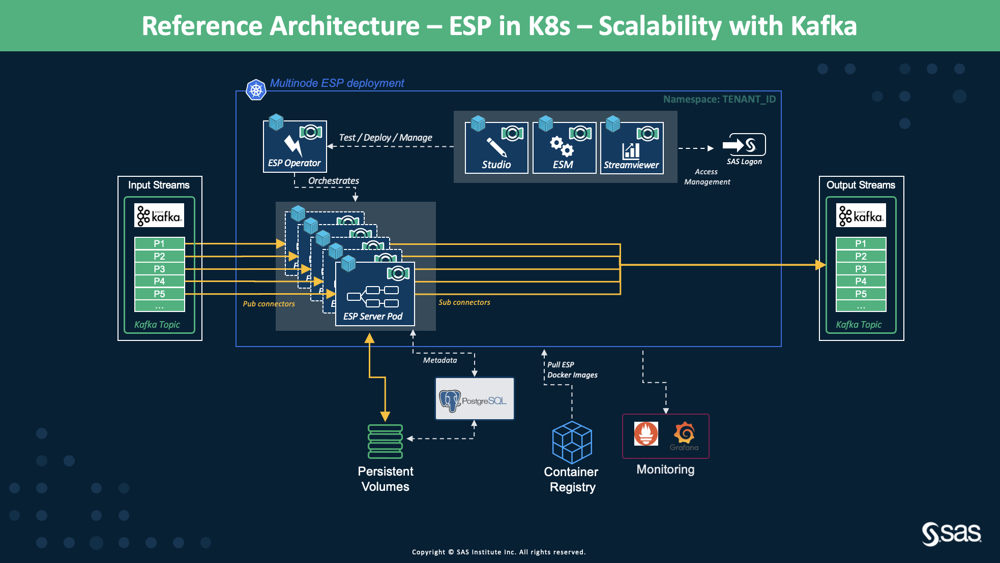
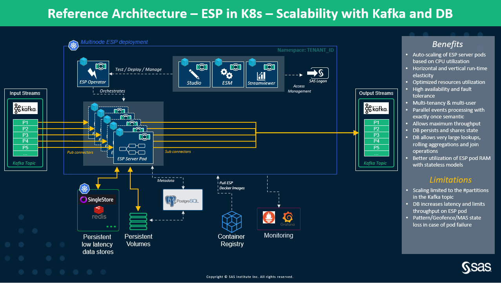

# Multi Node, ESP with Kubernetes with Kafka

* [Overview](multi_node_esp_kubernetes_using_kafka.md#overview)
* [Deployment Flavors](multi_node_esp_kubernetes_using_kafka.md#deployment-flavors)
  * [Scalability of ESP Server Pods with Kafka](multi_node_esp_kubernetes_using_kafka.md#scalability-of-esp-server-pods-with-kafka)
  * [Scalability of ESP Server Pods with Kafka using In-Memory Database for State and Data Persistence](multi_node_esp_kubernetes_using_kafka.md#scalability-of-esp-server-pods-with-kafka-using-in-memory-database-for-state-and-data-persistence)

## Overview
Kafka is an open-source distributed event streaming platform for high performance data streaming pipelines, capable of data integration with various data sources. It can be deployed on bare-metal hardware, virtual machines, and containers in on-premise as well as cloud environments. Almost all of the cloud platforms today, provide managed services for Kafka. 
We have a Kafka Connector to connect ESP with Kafka servers to publish/subscribe to Kafka topics. The [Kafka configuration properties](https://github.com/edenhill/librdkafka/blob/master/CONFIGURATION.md) can be changed directly from the Kafka connector.

In this section, we acheive scalability of stateful and stateless ESP server pods using Kafka message bus. 

## Deployment Flavors

### Scalability of ESP Server Pods with Kafka

#### Description
Figure 1 demonstrates the high level architecture of acheiving scalability of ESP server pods using Kafka. The scaling ESP server pods share the same consumer group to pull the data from the same Kafka topic which can have one or many partitions. With Kafka, we ensure that all the ESP server pods are processing incoming events with only-once semantic, i.e., events/messages are processed only once. 

During the events of ESP server pod crash or failure, Kafka undergoes rebalancing which means reassignment of partitions to the running ESP server pods. This ensures that the remaining ESP server pods continue to serve all the events from all the partitions in the Kafka topic. Kafka rebalances whenever an ESP server pod joins or leaves a consumer group. 

Kafka allows management of the offsets with which we can configure from what point in the topic or partition, the messages must be replayed to prevent any data loss. During the replay, there are chances that some events might get reprocessed. But, ESP XML project can be designed to handle/reject the duplicate events or they can be simply ignored if the use case allows. 

<figure align="center">
  
  <figcaption><i>Figure 1: Scalability of ESP Server Pods using Kafka</i></figcaption>
</figure>

#### Characteristics
- Kafka allows auto-scaling ESP server pods using the consumer group access the events/messages from the configured Kafka topic.
- Kafka provides configurable retention policy, i.e., storing the messages/events in the topics durably and reliably for as long as you want.
- Kafka allows management of the offsets with which we can configure from what point in the topic, the messages must be replayed to prevent any data loss.
- During the replay action, there might be some events that will get reprocessed. Rejecting the duplications events from getting reprocessed can be handled in the ESP model or completely ignored.

#### Limitations
- Number of scaling ESP server pods is limited by the number the of partitions in the topic from which ESP server pods are consuming the events using the same consumer group.
- For handled duplicate events from getting reprocessed, a mechanism needs to set up which would need a persistent volume to maintain the state to know which all events have been processed previously. This volume must be shared among all the ESP server pods for state and data sharing.
- If any state is maintained in the ESP server pod internal memory, then during an episode of crash and failure, the state would be lost. This can lead of expensive and time consuming recovery by replaying all the events once again to get back to the state.
- This architecture is useful for small retention periods which are in a few minutes, if a stateful project is in consideration. 

**NOTE:** This is a highly recommended architecture for auto-scaling stateless projects.

### Scalability of ESP Server Pods with Kafka using In-Memory Database for State and Data Persistence

#### Description
The high level architecture in Figure 2 overcomes the limitations of the architecture presented in Figure 1. The architecture in Figure 2 integrates with low latency, high throughput in-memory databases such as Singlestore, and Redis, for state and data persistence. For operations like joins, aggregations over large retention periods, in-memory databases are used to maintain the state which is shared among all the ESP server pods. We have two [SAS ESP StateDB Windows](https://go.documentation.sas.com/doc/en/espcdc/v_029/espcreatewindows/n01c9h6p6pmlcmn11w46am1xgnum.htm) in the ESP XML project to read/write to/from the in-memory databases. 

All the ESP server pods can access the in-memory database concurrently. 

<figure align="center">
  
  <figcaption><i>Figure 2: Scalability of ESP Server Pods with Kafka using In-Memory Database for State and Data Persistence</i></figcaption>
</figure>

#### Characteristics
- All the characteristics of the architecture in Figure 1 are applicable. 
- Use of in-memory databases for persisting state and data allow the ESP XML projects to be completely stateless. Therefore, no worries of losing data in the internal memory of the pods.
- The architecture has high availability, failover, and resiliency.
- No message loss and duplicates (if any) can be easily handled with the help of in-memory databases.

#### Limitations
- In-memory databases configuration, management, and orchestration need to be taken care of separately just like Kafka.
- Having an in-memory database means additional cost. 
- Concurrent access to the in-memory database also bring some performance degradation due to communication over the network.

