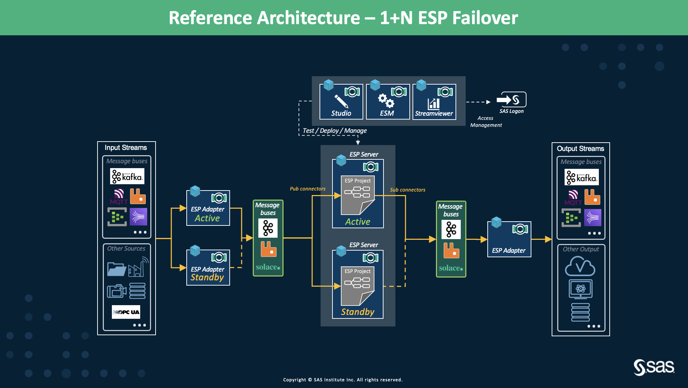
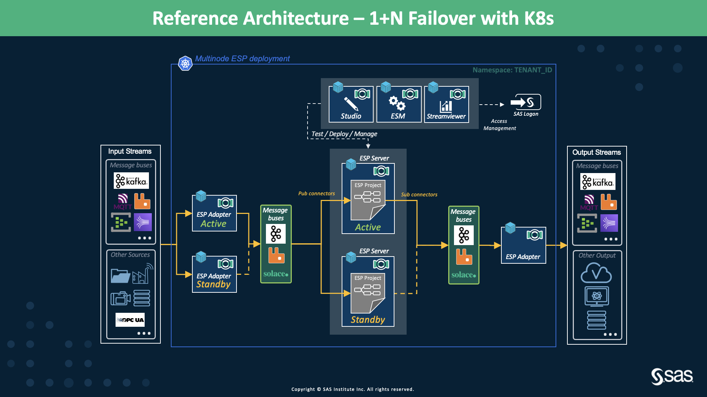

# ESP with Traditional High Availability with and without Kubernetes

* [Overview](ESP_With_HA.md#overview)
* [Deployment Flavors](ESP_With_HA.md#deployment-flavors)
  * [Deployment without Kubernetes](ESP_With_HA.md#deployment-without-kubernetes)
  * [Deployment with Kubernetes](ESP_With_HA.md#Deployment-with-Kubernetes)
  * [Stateless Models with DB for Persistent State](ESP_With_HA.md#stateless-models-with-db-for-persistent-state)
  * [Multiple Cascading Projects](ESP_With_HA.md#multiple-cascading-projects)

## Overview
SAS Event Stream Processing uses message buses to provide 1+N failover. A message bus connector/adapter can be configured to exchange CSV, JSON, or data in other text formats across the message bus. However, when enabled for failover, message subscribers must exchange binary event blocks. This is because only the binary event blocks contain the required message IDs required for failover. Failover in ESP is accomplished by seamlessly transitioning events generated by subscribed windows from an active instance of an ESP server to a standby instance when the active instance fails. The state of any ESP server in a 1+N ESP servers cluster is either “active” or “standby.” The state is maintained because all ESP servers receive every event from the message queue regardless of the server state. When the active ESP server in a failover cluster fails, the standby appliance connectors are notified. Then one of the standby servers takes over the role of active ESP server. The fabric tells the new active connector the ID of the last message that it received on the window-specific “out” topic. The new active connector begins sending data on that “out” topic with ID + 1.

**NOTE:** At present, we only support *Kafka*, *Solace*, and *RabbitMQ* to deploy 1+N failover.

## Deployment Flavors

### Deployment without Kubernetes

<figure align="center">
  
  <figcaption><i>Figure 1: HA architecture without Kubernetes</i></figcaption>
</figure>

#### Description
Figure 1 demonstrates the HA architecture with 1+N failover for a non-Kubernetes deployment. This architecture can be deployed on-premises and on private/public Cloud platforms. 

#### Characteristics
- Uses a message bus to provide 1+N failover.
- Suitable in cases where the rate of incoming events is more or less known and within bounds of the configurations.
- Suitable when high availability along with state persistence is needed.
- Detects duplication and gaps.
- Project state is maintained between servers.
- Best used when ESP project needs to maintain state.
- Multiple ESP servers are deployed via docker across multiple servers for resiliency.

#### Limitations
- Performance is limited by the configuration of the machine.
- Not possible to scale horizontally. Only vertical scaling is possible.
- All ESP servers in a 1+N failover cluster must run the same ESP XML project.
- Failover support is available only when the message format configured on the failover-enabled connectors is set to “binary”.
- Each HA project requires several HA configured message queue topics to be created.
- A manual restart is required for failed ESP servers and HA adapters.

#### Discussion
A large amount of resources needs to be configured to deploy the setup of 1+N failover. This architecture can be very expensive if many ESP servers are run in parallel with 1+N failover turned on. A full example with samples can be found on GitHub under [ESP High Availability using Kafka](https://gitlab.sas.com/IOT/reference-architectures/esp-high-availability-using-kafka-and-viya-4). 

**NOTE:** This architecture should only be used when Kubernetes is not available. 

#### ESP deliverables
- ESP server docker image. Available from version 2020.x onwards.
- ESP Studio, ESP Streamviewer, and Event Stream Manager docker images from version 2020.x.

### Deployment with Kubernetes
<figure align="center">
  
  <figcaption><i>Figure 2: HA architecture with Kubernetes</i></figcaption>
</figure>

#### Description
Figure 2 shows the HA architecture with Kubernetes. It is the same as that of Figure 1 except, it is now deployed in a Kubernetes cluster. There can be multiple communication methods between projects of achieving this. Let's look at some of the common properties across the methods.

#### Characteristics
- All the characteristics mentioned [in the above deployment architecture without Kubernetes](#characteristics) apply here. 
- Multiple ESP servers are deployed via Kubernetes for resiliency.
- Kubernetes will automatically restart any failed ESP server.
- HA adapters are also deployed into Kubernetes providing resiliency.

#### Limitations
- All the limitations mentioned [above](#limitations) apply here. 

#### Discussion
It is a very bulky deployment and resource-intensive. One must be very careful when choosing this architecture. This should be used only if it is necessary to have 1+N failover. 

### Stateless Models with DB for Persistent State
The purpose of this 1+N HA architecture is to keep the ESP state within its memory and allowing failover. If stateless models using a database for the persisting states can be designed, then this setup loses interest and must not be considered. We will then recommend using the [Multi Node ESP Kubernetes architecture](https://gitlab.sas.com/IOT/reference-architectures/esp-reference-architectures/-/blob/master/02_Multi_Node_ESP_Kubernetes/multi_node_esp_kubernetes_operator_framework.md) design.

### Multiple Cascading Projects
Due to the architecture complexity that would be required, we don't recommend designing cascading projects with this failover architecture. If cascading projects are required, we recommend using suitable [Multi Node ESP Kubernetes architectures](https://gitlab.sas.com/IOT/reference-architectures/esp-reference-architectures/-/blob/master/02_Multi_Node_ESP_Kubernetes/multi_node_esp_kubernetes_operator_framework.md). 
