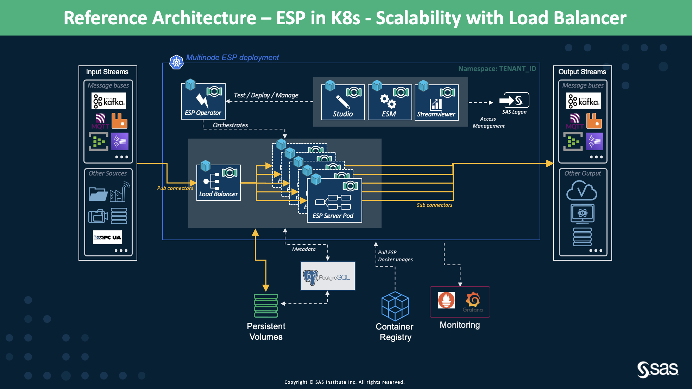

# Multinode, ESP Kubernetes using Load Balancer

* [Overview](multi_node_esp_kubernetes_using_loadbalancer.md#overview)
* [Deployment Flavors](multi_node_esp_kubernetes_using_loadbalancer.md#deployment-flavors)
  * [Standard High Level Architecture with ESP Load Balancer](multi_node_esp_kubernetes_using_loadbalancer.md#standard-high-level-architecture-with-esp-load-balancer)
  * [Stateless ESP Projects Using DB for Persistent State](multi_node_esp_kubernetes_using_loadbalancer.md#stateless-esp-projects-using-db-for-persistent-state)
  * [Multiple Cascading Projects Using Message Buses](multi_node_esp_kubernetes_using_loadbalancer.md#multiple-cascading-projects-using-message-buses)
  * [Multiple Cascading Projects Using Routers](multi_node_esp_kubernetes_using_loadbalancer.md#multiple-cascading-projects-using-routers)

## Overview
In this section, we provide architecture solutions involving ESP Load Balancer running in the Kubernetes cluster to distribute the incoming events to the running ESP server pods. This architecture is appropriate for scenarios where we require auto-scaling ESP server pods for handling the incoming events rate and parallel processing of independent events to achieve the required throughput. 

ESP Load Balancer is configured in the `Deployment Settings` of SAS Event Stream Manager before deploying the ESP XML project in the Kubernetes cluster. The Administrator must define the following for ESP Load Balancer to work:

- The load balancing policy (*round-robin*, *multicast*, *hash*, *consistent-hash*), 
- Minimum and maximum replicas (for auto-scaling), and 
- Target CPU utilization. 

For determining when to scale, we leverage [Horizontal Pod Autoscaler (HPA)](https://kubernetes.io/docs/tasks/run-application/horizontal-pod-autoscale/) of Kubernetes. 

ESP Load Balancer is capable of taking the events from various input sources, such as message buses, databases, files, etc. Once the events arrive at the ESP Load Balancer, it distributes these events to the ESP server pods based on the defined policy. ESP Load Balancer is aware of the scaling ESP project and automatically adds the new ESP server pod to the destination list. In the K8s environment, ESP Operator supports a CRD ESPLoadBalancer which is deployed during the ESP deployment. 

## Deployment Flavors

### Standard High Level Architecture with ESP Load Balancer
<figure align="center">
  
  <figcaption><i>Figure 1: Standard High Level Architecture with ESP Load Balancer</i></figcaption>
</figure>

#### Description
Figure 1 presents the simplest way of using the ESP Load Balancer. As described above in the [overview](https://gitlab.sas.com/IOT/reference-architectures/esp-reference-architectures/-/blob/master/05_Multi_Node_ESP_Kube_with_LoadBalancer/multi_node_esp_kubernetes_using_loadbalancer.md#overview), ESP Load Balancer sits between the data source and the ESP projects that process the incoming events. After the events are processed by the ESP server pods, the output events can be written directly to the desired endpoint(s) through the use of the pub/sub API and/or connectors.

Again, the ESP server pod running the ESP XML project uses its internal memory (assigned during the deployment time) to maintain any state information, for example, table for a join operation, events for aggregations over a defined retention period, patterns, or any global data values necessary for implementing the desired logic. 

#### Characteristics
- ESP Load Balancer only distributes the incoming streaming events and does not retain any events (no queue is maintained at the ESP Load Balancer).
- ESP Load Balancer is useful if the streaming sources do not have any distributions of *round-robin*, *multicast*, *hash*, and *consistent hash*.
- When ESP server pods scale in/out, ESP Load Balancer is aware and accordingly distributes the events.

#### Limitations
- If the project is stateful, then the state information is contained within the pods running the ESP projects. Therefore, during the pod failure, the stored state data is permanently lost. (How much of an issue this is, depends on the requirements of the use case and time required to recreate the lost state.
- ESP Load Balancer does not retain any events. When it fails/crashes, the new ESP Load Balancer is started by the Kubernetes and it takes over the distribution of the events.

#### Discussion
While this is a fairly simple architecture but does suffer from the above-mentioned limitations. However, if the time scale is sufficiently small, for example, monitoring the performance of some system in which statistics are calculated with a granularity of seconds or minutes, then this architecture is still a good choice. As recovering from the fraction of seconds/minutes of lost data is trivial and faster. 
Another example is when the state is maintained by the Pattern windows. Patterns frequently/usually have time limits associated with them. Again, patterns with time limits on the order of seconds or minutes will be less vulnerable to loss of state, and if any state is lost, it is quite fast to recover.

### Stateless ESP Projects Using DB for Persistent State
<figure align="center">
  
  <figcaption><i>Figure 2: High Level Architecture for running Stateless ESP Projects Using DB for Persistent State</i></figcaption>
</figure>

#### Description
The architecture demonstrated in Figure 2 is similar to the one above, but instead of exclusively maintaining state within the pods running the ESP projects, we make use of an in-memory database to share/persist the state and data across the ESP server pods. This in-memory database can be deployed within the same Kubernetes cluster, or different or any other virtual machines. Currently, we support 3 in-memory databases, i.e., Aerospike, SingleStore, and Redis.

#### Characteristics
- In-memory databases allow state and data persistence and sharing across all the ESP server pods. The ESP server pods can now be stateless if join and aggregation operations are involved.
- In events of ESP server pod failure/crash, state and data are recovered from the in-memory databases. The new ESP server can grab the last state from the in-memory database, and resume.
- No data loss and fast auto-recovery from failure.

#### Limitations
- The biggest limitation of this architecture is its negative impact on latency. The transfer of data back and forth from the in-memory database will add some latency, but this may not be an issue for many deployments. 
- While the in-memory database is used to retain state data, not all state data can be stored there. Currently, only aggregation data and join tables can be kept in the in-memory database, while state data for patterns, geofences, and others must still be maintained by the individual ESP server pod in their internal memory.

#### Discussion
This architecture is a good choice for a deployment that will potentially need a significant amount of state retention. In contrast to the above architecture, the amount of desired state maintenance is limited only by the size of the in-memory database. But this is not a problem at all, as all the in-memory databases are capable of horizontal and vertical auto-scaling as the demand increases. The in-memory databases ensure that the state data will be retained even if the cluster is hit with some outages as they provide guarantees on high availability, failover, and resiliency. 

The following two architectures are similar to the ones described above, but they involve cascading ESP projects. This means that the processing steps required by the ESP XML project are split among more than 1 ESP project. This is distinct from the case in which duplicates of a project are created to handle traffic increase (#incoming events).

### Multiple Cascading Projects Using Message Buses

#### Description
In this architecture, we use message buses between the cascading projects which will receive events from the upstream projects and provide events to the downstream projects. This architecture is a combination of two architectures, (1). [Multiple Cascading Projects Using Message Buses](https://gitlab.sas.com/IOT/reference-architectures/esp-reference-architectures/-/blob/master/03_Multi_Node_ESP_Kubernetes/multi_node_esp_kubernetes_operator_framework.md#multiple-cascading-projects-using-message-buses) and (2). the [Standard High Level Architecture with ESP Load Balancer](multi_node_esp_kubernetes_using_loadbalancer.md#standard-high-level-architecture-with-esp-load-balancer) described above.

There can be multiple groups of cascading projects, and each of these sub-projects can be either 
- a single project, or 
- a combination of an ESP Load Balancer and its associated balanced ESP server pods

The cascading sub-projects are designed based on the use case requirements.

#### Limitations
- One important thing to consider is that there cannot be more ESP projects subscribed to a Kafka topic than the number of partitions in that topic. When designing a deployment using this architecture, the number of partitions set for any topic should be at least the maximum anticipated number of subscriber ESP projects, if not a few more just to be safe. 
- Another consideration is the fact that the flow of events back and forth from Kafka introduces some latency, though this is not a problem for many use cases. 
- Since there is no in-memory database, the state will be maintained by the individual ESP projects. Therefore, loss of the ESP server equals loss of saved state. To prevent this, one can integrate architecture [Stateless ESP Projects Using DB for Persistent State](multi_node_esp_kubernetes_using_loadbalancer.md#stateless-esp-projects-using-db-for-persistent-state) with cascading projects.

#### Discussion
This is a robust architecture for almost any application in which a longer-term state does not need to be maintained. The fact that there are cascading ESP projects means that resources can be dedicated to parts of the deployment that require more processing power. This architecture will also work well for input data streams that have an irregular rate. For example, applications that have incoming data which consists of customer transactions will have periods of high and low traffic. The ESP load balancer and auto-scaling of the ESP server pods will make sure that the incoming event streams are processed without backpressure and the events are delivered to their respective Kafka topics, where they will be fed to the next group of projects in the cascade.

### Multiple Cascading Projects Using Routers
Considering the current orchestration limitations of the ESP Routers (2021.x) in K8s and the manual steps involved, this is not a recommended option. 

