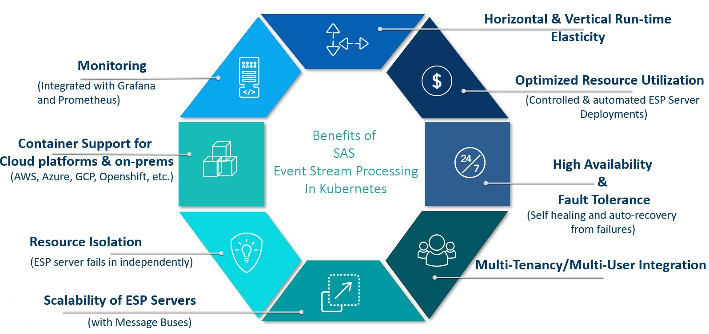
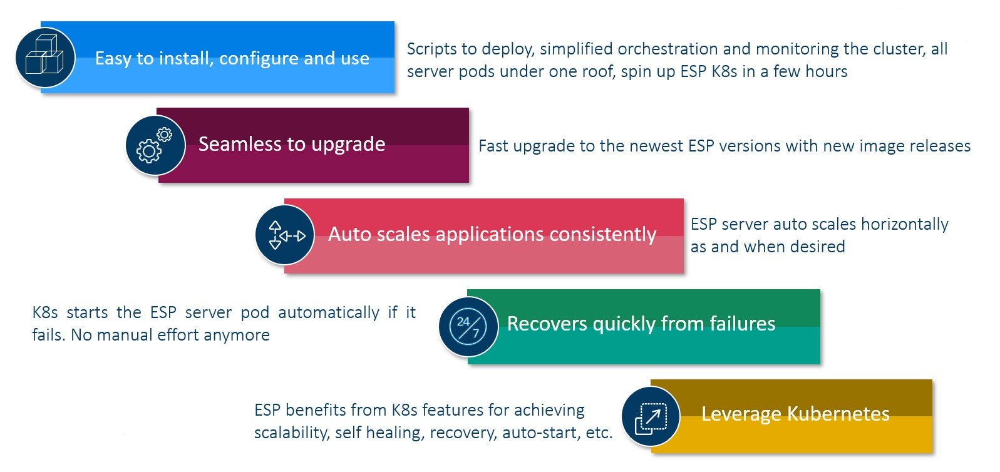
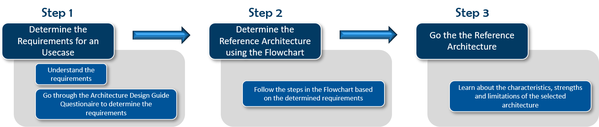
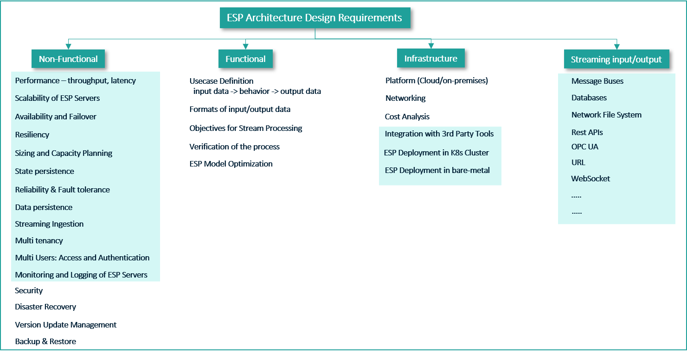
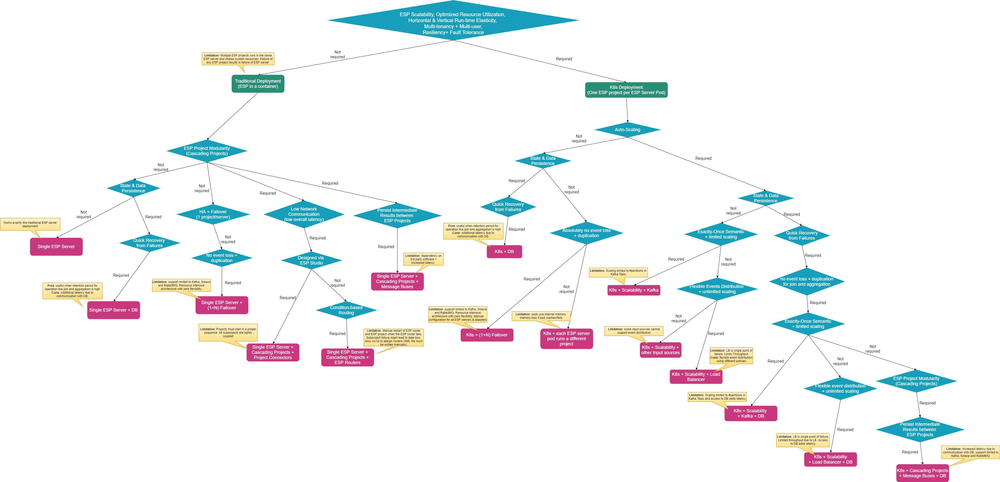

# SAS Event Stream Processing Reference Architectures

This project covers various reference architectures for SAS Event Stream Processing (ESP) and includes the best practices based on customer/partner use-case's functional and non-functional requirements.

## Table of Contents
* [1. Overview](#1-overview)
* [2. Understanding the New ESP Paradigm](#2-understanding-the-new-esp-paradigm)
* [3. Benefits of Deploying ESP in Kubernetes](#3-benefits-of-deploying-esp-in-kubernetes)
* [4. Why You Should Migrate to ESP in Kubernetes](#4-why-you-should-migrate-to-esp-in-kubernetes)
* [5. Points to Remember when migrating to ESP in Kubernetes](#5-points-to-remember-when-migrating-to-esp-in-kubernetes)
* [6. Steps to Determine the Recommended Reference Architecture](#6-steps-to-determine-the-recommended-reference-architecture)
* [7. Determine the Usecase Requirements](#7-determine-the-usecase-requirements)
  * [Understanding the ESP Architecture Design Requirements](#understanding-the-esp-architecture-design-requirements)
  * [Definitions of Non-Functional Requirements](#definitions-of-non-functional-requirements)
  * [Real-time Streaming Architecture Design Guide Questionaire](#real-time-streaming-architecture-design-guide-questionaire)
* [8. Decision-Tree to Determine the Reference Architecture Based on the Requirements](#8-decision-tree-to-determine-the-reference-architecture-based-on-the-requirements)
* [9. Reference Architectures](#9-reference-architectures)
* [10. Additional Resources](#10-additional-resources)

## 1. Overview
SAS Event Stream Processing has entered the world of Kubernetes and containerization where all the ESP servers and web clients are deployed as Kubernetes pods. This has also brought up new architecture designs to solve business challenges. In this project repository, you will learn about the new ESP paradigm, what are several benefits of deploying ESP in the Kubernetes cluster and why it is now extremely crucial for the customers/partners to migrate the traditional deployment of ESP to ESP running in Kubernetes. 
We will further discuss the steps to determine the right reference architecture based on the functional and non-functional requirements of the business problem. 

## 2. Understanding the New ESP Paradigm
In Kubernetes, the ESP server is deployed as a K8s pod where each ESP server pod runs one and only one ESP Model. This is quite crucial to know because the failure of one ESP project doesn’t affect the functioning of others. In older ESP, ie, without Kubernetes, all the projects would run on the same server. A crash of one project would crash the whole ESP server. And all the projects have to be restarted from scratch.

In Kubernetes deployment, each ESP server gets its dedicated resources, ie, CPU and memory. We provide these resources under the deployment settings in the ESP Studio and Event Stream Manager before launching the project in the Kubernetes cluster. 

Under the deployment settings, we also set the auto-scaling parameters. ESP server pods leverage the Kubernetes horizontal pod auto-scaler to scale in and out depending on the CPU utilization to handle the fluctuating incoming events workload.

We can run both Stateful and Stateless ESP XML models in Kubernetes.

## 3. Benefits of Deploying ESP in Kubernetes
Below are the benefits of deploying ESP in the Kubernetes cluster. ESP leverage all the features and capabilities of Kubernetes that makes it more robust and easy to deploy, use, and manage. 

- K8s cluster provides horizontal and vertical runtime elasticity which allows running as many ESP server pods as required at any point in time.
- It provides great optimization on resource utilization as each ESP server gets its dedicated resources. K8s makes the best effort to optimize the total CPU and memory on each node of the cluster. 
- ESP server pods in Kubernetes are highly available and auto-recovers from failures.
- ESP allows enterprises to create multi-user, multi-tenant deployments. We provide all the scripts to create the deployment with various options such as single-user, multi-user, single-tenant, and multi-tenant. Multi-user is achieved by UAA to create access credentials for several users. For multi-tenant, we leverage the namespace of K8s, i.e., each namespace is a tenant.
- ESP server pods auto-scales based on the CPU utilization to handle the incoming events. It uses the Horizontal Pod Autoscaler (HPA) of the Kubernetes framework.
- If an ESP server pod failed, it fails independently, i.e., it does not affect the other running ESP server pods. This allows all the other projects to continue running in their own ESP server pods. 
- We provide full integration and support for running ESP in fully managed K8s services of cloud platforms and non-managed K8s clusters on-prem. There are two deployment options, (1). deploying standalone ESP (lightweight) and (2). deploying ESP with Viya 4. For both types of deployment, we provide all the required scripts for all the cloud platforms and on-premises. 
- The health and performance of the ESP server and other pods can be monitored using integrated Grafana and Prometheus monitoring tools. We provide 2 ready-to-use dashboards. Users can create their dashboards if required. 

We have encountered several business use cases, where scalability, high availability, failover, and auto-recovery were primary requirements. And these can only be achieved by having ESP running in K8s. 

<figure align="center">
  
  <figcaption><i>Figure 1: Benefits of ESP in Kubernetes</i></figcaption>
</figure>

## 4. Why you should migrate to ESP in Kubernetes
There are many reasons apart from the benefits ESP in Kubernetes provides. 

- We provide all the scripts and support to install ESP in K8s which makes the deployment very straightforward. The beauty of this deployment is that all the pods are running at the same place in the same K8s cluster which makes it further simplified to orchestrate and monitor the pods. 
- We are releasing new images every month. The ESP upgrades seamlessly.
- Scalability is now very important given the speed with which we are generating data and the number of devices we have around us. ESP in K8s auto-scales to handle all the incoming events which are not possible with the older version, non-K8s ESP deployment.
- Since K8s restarts the pod automatically whenever one of the ESP server pods fails, recovery from failure is almost unnoticeable. With the older, single-server architecture, one has to restart the server and then start all the projects again which can be expensive & time-consuming. 

The new ESP architecture leverages all the features that K8s offers which makes the whole deployment more reliable, fault-tolerant, and scalable. 

<figure align="center">
  
  <figcaption><i>Figure 2: Why migrate to ESP in Kubernetes</i></figcaption>
</figure>

## 5. Points to Remember When Migrating to ESP in Kubernetes
Here is the list of points that we should consider when migrating from ESP 6 or older versions to the latest version ESP 2022.x. 

### Model Hierarchy
In the older versions of ESP, we have one ESP engine which can run multiple ESP XML projects. All the projects share computing resources and internal memory. The single ESP server could be connected by using the hostname and port. But in the new paradigm, for the new ESP version, we have one and only one ESP project per ESP server pod when deployed in the K8s cluster. Each ESP server pod gets its dedicated CPU and memory which is configurable during the deployment of the ESP project from Event Stream Manager (ESM). There is no single ESP server to connect to.

### REST Calls
####  
**1.** The REST calls to collect the data from or send data to the ESP server pod in the K8s environment will not work as they used to. You will need the ingress address of the ESP server pod. Additionally, the authentication mechanism should be in place. For both, Viya 4 deployment and ESP standalone (lightweight) then you would need an OAuth token to authenticate. *NOTE*: You can use the [RESTful APIs for ESP Edge server deployment](https://go.documentation.sas.com/doc/en/espcdc/v_030/espxmllayer/p111ycfjon4sran1a72zunszhq5x.htm). 

*Recommended Workaround*: The better approach is to use message buses like Kafka to read and write data in/out of the ESP pods either using [REST Calls of Kafka](https://docs.confluent.io/platform/current/kafka-rest/index.html) or any other mechanism. You can use publish and subscribe Kafka connector of ESP to do the same. 
#### 
**2.** You shouldn’t use REST Calls or scripts to start and stop the ESP projects in the currently running ESP server pods in K8s from outside. It is not supported and we do not recommend it. Doing so can bring unsupported issues with the ESP server pod and can have unintended side effects on the web-client applications, primarily, ESP Studio and ESM. We should stick to the ESP paradigm of one project per ESP server pod. 

*Recommended Workaround*: Only use ESP Studio and ESM to start and stop the ESP projects.
#### 
**3.** The REST calls for admin-related queries should not be used. 

*Recommended Workaround*: [Prometheus](https://go.documentation.sas.com/doc/en/espcdc/v_030/espex/p0rwojd7hnzcymn117e1ilapqgqm.htm) is a better way to monitor the K8s cluster and obtain all information regarding the performance (consumption of CPU and memory by each pod and node), health, and status of the pods. Prometheus has already been integrated well. We are working on the development of the Grafana plugin for visualizing the server data and other metrics.

### Websocket APIs
It works as it has been working so far. All you need is the ingress address to the ESP server pod and the correctly formed URL.

For open environment:
```posh
https://INGRESS_ADDRESS/SASEventStreamProcessingServer/PROJECT_NAME/eventStreamProcessing/v1/ 
````

For multi-user environment:
```posh
https://INGRESS_ADDRESS/SASEventStreamProcessingServer/PROJECT_NAME/eventStreamProcessing/v1/ -H 'Authorization: Bearer <put a valid access token here>'
````

### Project Publish Connector
The [Project Publish Connector](https://go.documentation.sas.com/doc/en/espcdc/v_030/espca/p0nd0g1i4np1h1n15zmar9fhln8u.htm) cannot be used to connect different ESP projects in the Kubernetes environment where each project runs in its dedicated immutable ESP server pod. 

*Recommended Workaround*: Use message buses to pass events between the cascading ESP projects.

*NOTE*: Project Publish Connector will work in the ESP edge server deployment. 

### Event Stream Processor Adapter
The [Event Stream Processor Adapter](https://go.documentation.sas.com/doc/en/espcdc/v_030/espca/p1jphyktahiqgnn1513yv0tqisq8.htm) will also not work in the Kubernetes environment. 

*Recommended Workaround*: Use message buses to pass events between the cascading ESP projects.

*NOTE*: Event Stream Processor Adapter will work in the ESP edge server deployment. 

### ESP Connectors/Adapters
- Use Connectors wherever available.
- All adapters should run through Adapter Connector.
- Note for Custom Adapters, the executable file for the adapter must reside in `$DFESP_HOME` or `$DFESP_HOME/bin`.
- Any custom adapter that should run through the Adapter connector should begin with `dfesp_`.
- When working with autoscaling of ESP server pods, verify the effects of connectors/adapters to prevent event/data duplication. *NOTE*: Some connectors and adapters cannot be used for event distribution.

### Java-based APIs
The Custom implementation of Java-based API to fetch or push data from 3rd party applications to ESP server pods will work but not as it is. You will need the right path to the ESP server pod (ingress address) and credentials (if any). 

*Recommended Workaround*: Use message buses OR create a custom adapter for the requirement.

### External Files
The external files or libraries cannot be accessed directly as we cannot provide absolute paths to the files in the Kubernetes environment. The persistent volumes (PV) must be configured during the ESP or Viya 4 deployment which must be accessible by the pods. You can use these persistent volume mounts to provide external files to the ESP server pods. For example, PVs are used for sharing ASTORE models, CSV, Binary, JSON, XML, Syslog, etc.

### ESP StateDB Reader and Writer Windows
- We now provide support to SingleStore and Redis in-memory data stores using [ESP StateDB Windows](https://go.documentation.sas.com/doc/en/espcdc/v_030/espcreatewindows/n01c9h6p6pmlcmn11w46am1xgnum.htm).  
- They are used to store state information for Joins and Aggregations; and also for data persistence.
- You can store reference data in the in-memory databases which needs to be shared across the ESP server pods.
- The ESP projects run stateless as the state and data are maintained and managed outside of ESP. 
- Easy auto-scaling and recovery from failure as no internal state needs to be managed or recovered. Both state and data persist in the in-memory databases. 

### Lua integration
- We now have a [ESP Lua Window](https://go.documentation.sas.com/doc/en/espcdc/v_030/espcreatewindows/p0yj92wgv3ssyyn1syatsh9l1t74.htm) that allows generating ESP events with Lua program. It allows the developer to debug the Lua code while designing the Lua window.
- You can define Lua-based filter conditions in the window.
- We have also added [Lua support in the ESP Pattern Window](https://go.documentation.sas.com/doc/en/espcdc/v_030/espcreatewindows/n1rj6nmwuzuxisn12tjeu0o336tt.htm#n1cqb236h0t3x2n1ft2bk7esss9v) where you can write Lua functions to specify the events of interest and also generate the output events as the result of applying pattern logic.
- Another addition is the [ESP Lua connector](https://go.documentation.sas.com/doc/en/espcdc/v_030/espca/p0ofbx04mv7n85n1mds3bck22qq0.htm) which uses Lua programs to perform parsing of unstructured data (such as JSON, XML), to read data from URLs and use Lua code to inject events (alternative to the URL connector), and to replace the ESP file/socket connector (remove dependency on external files). 
*NOTE*: Lua is embedded into the ESP server image, so no external Lua interpreter is required to run programs.

## 6. Steps to Determine the Recommended Reference Architecture
In this project repository, we will share different reference architectures of ESP and how one can evaluate which one out of these is the best fit for your customer/partner use-case. Figure 3 below provides the steps that one must follow to determine the right architecture for their business problem. 

**NOTE:** In this project we do not provide any guidelines on the ESP project modeling. 

<figure align="center">
  
  <figcaption><i>Figure 3: Steps to Determine the Reference Architecture</i></figcaption>
</figure>


## 7. Determine the Usecase Requirements
To determine the right architecture, it is important to understand the customers' long-term business objectives. The below sections explain <br>

1. The different types of design requirements to consider and their importance, 
2. Questionaire helps to ask the right questions to determine the right requirements, and
3. Following the flowchart/Decision-Tree to reach the architecture that fulfills all the business goals.

### Understanding the ESP Architecture Design Requirements
Figure 4 presents the non-functional, functional, infrastructure, and streaming input/output requirements for a use-case to determine the right ESP architecture.

**Non-Functional** requirements define the quality attributes of the applications, i.e., ESP. These requirements allow the architect to impose constraints or restrictions on the design of the overall architecture. 

**Functional** requirements define a system and its components that are required by the application to perform the desired behavior. They primarily are derived from the use-case objectives, what will the input data sources and outputs, should be the format of the data in consideration, how the application must process it, and finally, verifying the correctness of the obtained output. It is usually defined in terms of calculation, transformations, data manipulation, business processes, user interaction, and various tasks to be performed by the ESP.

By **Infrastructure** requirement we mean the platform to be used for deploying the ESP. Using Cloud adds several benefits as the cloud-native services can be leveraged and many 3rd party tools/applications in need can be managed services provided by the Cloud platforms. This comes at a cost. 

We will also look into **Streaming Input/Output** which means how from where and what format of the input data/events are streamed to the ESP and where the output results must be streamed to. We also consider the volume, velocity, and variety of the streaming events as well. 

In this GitLab project, we will focus on the non-functional and streaming input/output design requirements to determine the right infrastructure and select the right architecture. 

<figure align="center">
  
  <figcaption><i>Figure 4: ESP Architecture Design Requirements</i></figcaption>
</figure>

### Definitions of Non-Functional Requirements
The [ESP reference architectures use the standard definitions](definitions.md) from Cloud Computing (Distributed Systems). 

### Real-time Streaming Architecture Design Guide Questionaire
During designing or architecting a solution, we must ask questions! A lot of questions! The [Streaming Architecture Design Guide Questionaire](06_Architecture_Guide_Questions/Arch_Guide_Questions.md) provides a comprehensive list of questions one must ask to architect a complete solution based on the provided business requirements.

## 8. Decision-Tree to Determine the Reference Architecture Based on the Requirements

Figure 5 presents the Design-Tree/Flowchart which is built using the possible business requirements a customer/partner would have. The flowchart helps in determining the right ESP reference architecture that fulfills the business needs. It is also possible to have a mix of many architectures if many paths in the flowchart are realized.
It is extremely necessary to have a complete list of requirements to obtain the most suitable architecture.

<figure align="center">
  
  <figcaption><i>Figure 5: Design Tree to Determine the Reference Architecture</i></figcaption>
</figure>


## 9. Reference Architectures
* [01. ESP Edge Server Deployment](01_ESP_Edge_Server_Deployment/ESP_Edge_Server.md)
* [02. Multi-Node, ESP Operator Kubernetes Framework](02_Multi_Node_ESP_Kubernetes/multi_node_esp_kubernetes_operator_framework.md)
* [03. Multi-Node, ESP with Kubernetes using Kafka](03_Multi_Node_ESP_Kube_with_Kafka/multi_node_esp_kubernetes_using_kafka.md)
* [04. ESP with traditional High Availability with and without Kubernetes](04_ESP_With_HA/ESP_With_HA.md)

## Contributing

> We welcome your contributions! Please read [CONTRIBUTING.md](CONTRIBUTING.md) for details on how to submit contributions to this project. 

## License

> This project is licensed under the [Apache 2.0 License](LICENSE).


## 10. Additional Resources
* [Auto-scaling ESP server pods using Kafka and persist state/data using Aerospike Database in Azure](https://gitlab.sas.com/IOT/reference-architectures/esp-kubernetes/esp-kubernetes-with-aerospike-in-azure-environment)
* [SAS ESP State and Data Management with Singlestore Database](https://gitlab.sas.com/IOT/reference-architectures/esp-kubernetes/singlestore-database-with-esp-in-kubernetes)
* [In-memory Databases Plugin](https://gitlab.sas.com/IOT/projects/esp-retention-and-state-persistence)
* [Customize ESP Server Docker Image with Aerospike Plugin](https://gitlab.sas.com/IOT/reference-architectures/esp-kubernetes/customize-esp-server-docker-image-with-aerospike-plugin)
* [ESP High Availability using Kafka without Kubernetes](https://gitlab.sas.com/IOT/reference-architectures/esp-high-availability-using-kafka)
* [Create and deploy an ESP HA system using Kafka and Viya 4](https://gitlab.sas.com/IOT/reference-architectures/esp-high-availability-using-kafka-and-viya-4)

