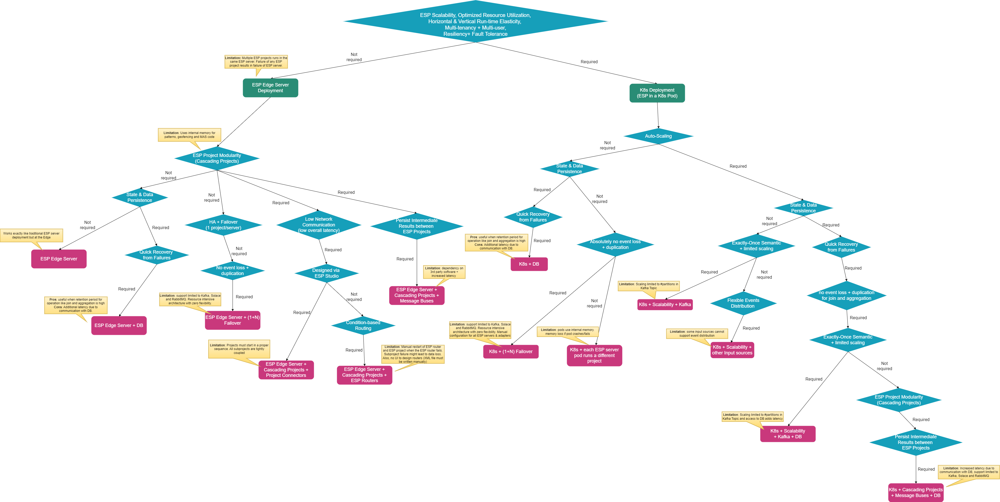

# SAS Event Stream Processing Reference Architectures

This project covers various reference architectures for SAS Event Stream Processing (ESP) and includes the best practices based on customer/partner use-case's functional and non-functional requirements.

## Table of Contents
* [1. Introduction](#1-introduction)
* [2. Determine the Usecase Requirements](#2-determine-the-usecase-requirements)
  * [Understanding the ESP Architecture Design Requirements](#understanding-the-esp-architecture-design-requirements)
  * [Definitions of Non-Functional Requirements](#definitions-of-non-functional-requirements)
  * [Real-time Streaming Architecture Design Guide Questionaire](#real-time-streaming-architecture-design-guide-questionaire)
* [3. Decision-Tree to Determine the Reference Architecture Based on the Requirements](#3-decision-tree-to-determine-the-reference-architecture-based-on-the-requirements)
* [4. Reference Architectures](#4-reference-architectures)
* [5. Additional Resources](#5-additional-resources)

## 1. Introduction
In this project repository, we will share different reference architectures of ESP and how one can evaluate which one out of these is the best fit for your customer/partner use-case. Figure 1 below provides the steps that one must follow to determine the right architecture for their business problem. 

**NOTE:** In this project we do not provide any guidelines on the ESP project modeling. 

<figure align="center">
  
  <figcaption><i>Figure 1: Steps to Determine the Reference Architecture</i></figcaption>
</figure>

## 2. Determine the Usecase Requirements
To determine the right architecture, it is important to understand the customers' long-term business objectives. The below sections explains  

1. The different types of design requirements to consider and their importance, 
2. Questionaire helps to ask the right questions to determine the right requirements, and
3. Following the flowchart/Decision-Tree to reach the architecture that fulfills all the business goals.

### Understanding the ESP Architecture Design Requirements
Figure 2 presents the non-functional, functional, infrastructure, and streaming input/output requirements for a use-case to determine the right ESP architecture.

**Non-Functional** requirements define the quality attributes of the applications, i.e., ESP. These requirements allow the architect to impose constraints or restrictions on the design of the overall architecture. 

**Functional** requirements define a system and its components that are required by the application to perform the desired behavior. They primarily are derived from the use-case objectives, what will the input data sources and outputs, what should be the format of the data in consideration, how the application must process it, and finally, verifying the correctness of the obtained output. It is usually defined in terms of calculation, transformations, data manipulation, business processes, user interaction, and various tasks to be performed by the ESP.

By **Infrastructure** requirement we mean the platform to be used for deploying the ESP. Using Cloud adds several benefits as the cloud-native services can be leveraged and many 3rd party tools/applications in need can be managed services provided by the Cloud platforms. This comes at a cost. 

We will also look into **Streaming Input/Output** which means how from where and what format of the input data/events are streamed to the ESP and where the output results must be streamed to. We also consider the volume, velocity, and variety of the streaming events as well. 

In this GitLab project, we will focus on the non-functional and streaming input/output design requirements to determine the right infrastructure and select the right architecture. 

<figure align="center">
  
  <figcaption><i>Figure 2: ESP Architecture Design Requirements</i></figcaption>
</figure>

### Definitions of Non-Functional Requirements
The [ESP reference architectures use the standard definitions](definitions.md) from Cloud Computing (Distributed Systems). 

### Real-time Streaming Architecture Design Guide Questionaire
During designing or architecting a solution, we must ask questions! A lot of questions! The [Streaming Architecture Design Guide Questionaire](06_Architecture_Guide_Questions/Arch_Guide_Questions.md) provides a comprehensive list of questions one must ask to architect a complete solution based on the provided business requirements.

## 3. Decision-Tree to Determine the Reference Architecture Based on the Requirements

Figure 3 presents the Design-Tree/Flowchart which is built using the possible business requirements a customer/partner would have. The flowchart helps in determining the right ESP reference architecture that fulfils the business needs. It is also possible to have mix of many architectures, if many paths in the flowchart are realized.
It is extremely necessary to have the complete list of requirements to obtain the most suitable architecture.

<figure align="center">
  
  <figcaption><i>Figure 3: Design Tree to Determine the Reference Architecture</i></figcaption>
</figure>

## 4. Reference Architectures
* [01. Single-Node, Single ESP Server Deployment](01_Single_Node_Single_ESP_Server_Deployment/Single_ESP_Server.md)
* [02. ESP with traditional High Availability with and without Kubernetes](02_ESP_With_HA/ESP_With_HA.md)
* [03. Multi-Node, ESP Operator Kubernetes Framework](03_Multi_Node_ESP_Kubernetes/multi_node_esp_kubernetes_operator_framework.md)
* [04. Multi-Node, ESP with Kubernetes using Kafka](04_Multi_Node_ESP_Kube_with_Kafka/multi_node_esp_kubernetes_using_kafka.md)
* [05. Multi-Node, ESP with Kubernetes using Load Balancer](05_Multi_Node_ESP_Kube_with_LoadBalancer/multi_node_esp_kubernetes_using_loadbalancer.md)

## Contributing

> We welcome your contributions! Please read [CONTRIBUTING.md](CONTRIBUTING.md) for details on how to submit contributions to this project. 

## License

> This project is licensed under the [Apache 2.0 License](LICENSE).

## 5. Additional Resources
* [Auto-scaling ESP server pods using Kafka and persist state/data using Aerospike Database in Azure](https://gitlab.sas.com/IOT/reference-architectures/esp-kubernetes/esp-kubernetes-with-aerospike-in-azure-environment)
* [SAS ESP State and Data Management with Singlestore Database](https://gitlab.sas.com/IOT/reference-architectures/esp-kubernetes/singlestore-database-with-esp-in-kubernetes)
* [In-memory Databases Plugin](https://gitlab.sas.com/IOT/projects/esp-retention-and-state-persistence)
* [Customize ESP Server Docker Image with Aerospike Plugin](https://gitlab.sas.com/IOT/reference-architectures/esp-kubernetes/customize-esp-server-docker-image-with-aerospike-plugin)
* [ESP High Availability using Kafka without Kubernetes](https://gitlab.sas.com/IOT/reference-architectures/esp-high-availability-using-kafka)
* [Create and deploy an ESP HA system using Kafka and Viya 4](https://gitlab.sas.com/IOT/reference-architectures/esp-high-availability-using-kafka-and-viya-4)

